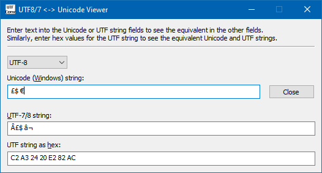

# UTF8Conv

This program will convert strings between Windows Unicode (UTF-16) and UTF-8 or UTF-7 character encodings and also present the raw binary data (as hex).

Select either UTF-8 or UTF-7 from the drop list, and type or paste your text into the appropriate field to see it instantly converted into the other forms.

